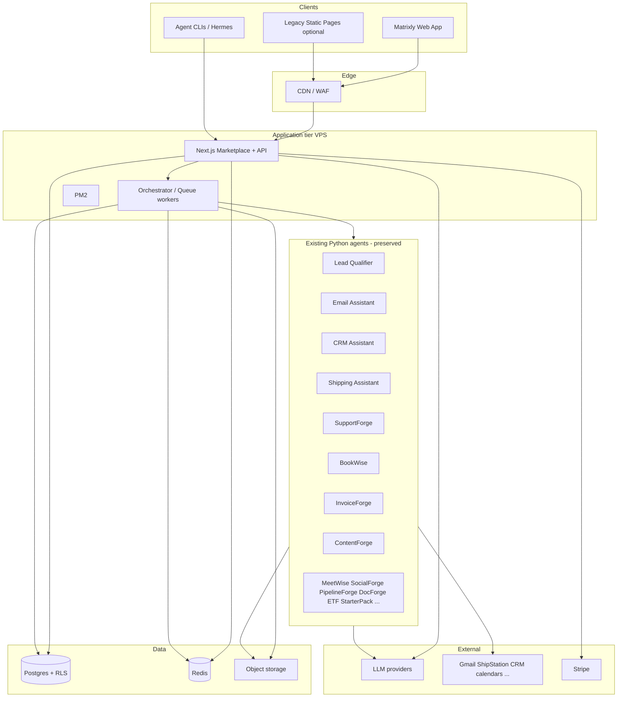
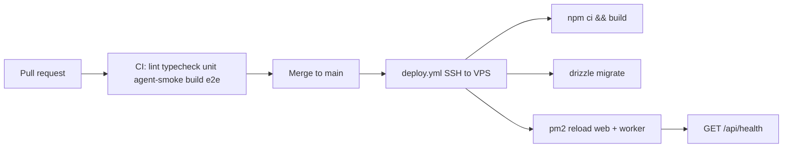

# Matrixly — Modernization Stack, Audit, QA & Migration Plan

**Context:** Live production = static HTML + Tailwind CDN + vanilla JS marketing site; many Python pilot agents with HITL; agents run separately from the static host.  
**Goal:** Evolve into a multi-tenant agent marketplace + runtime (modern no-code agent platforms as *architectural* inspiration) while **preserving all agents** and the **exact Matrixly design system** (`docs/DESIGN_SYSTEM.md`).  
**Brand:** Matrixly only. No third-party product branding. No domain names in this document.

---

## 1. Recommended Full Tech Stack

| Layer | Recommendation | Justification |
|-------|----------------|---------------|
| **Frontend** | **Next.js (App Router) + TypeScript + Tailwind + design tokens from DESIGN_SYSTEM** | SSR/SEO for marketplace; RSC where safe; single TS app for marketing + authenticated product; preserves Tailwind class patterns |
| **UI kit** | shadcn/ui **restyled** to Matrixly tokens (not default shadcn look) | Speed + a11y primitives; theme stays Matrixly blue/navy |
| **Backend API** | Next.js Route Handlers + **tRPC** (or Hono sidecar if needed) | End-to-end types; low ops overhead early-stage |
| **Database** | **Postgres** (managed: Supabase or equivalent) + **Drizzle ORM** | Multi-tenant relational model, RLS, strong audit queries |
| **Auth** | Supabase Auth **or** Auth.js + Postgres | Email + Google/Microsoft SSO; workspace memberships |
| **Object storage** | S3-compatible (Supabase Storage / R2) | Exports, invoices, agent artifacts |
| **Queue / workflows** | **Redis + BullMQ** (MVP); evaluate Temporal later | Long-running agent jobs, retries, concurrency limits |
| **Agent runtime** | **Keep Python pilots as first-class workers/skills**; thin **TypeScript orchestrator** for deploy/run/HITL | Zero rewrite of existing agents; preserve HITL scripts |
| **LLM gateway** | Provider interface (Grok/xAI first; pluggable) | Metering, failover, no hard lock-in |
| **Tools / integrations** | MCP adapters + existing IMAP/ShipStation/etc. clients | Gradual connector unification without big-bang |
| **SEO intelligence** | First-party SEO service package + SERP/data vendor | Keywords, content jobs, rank snapshots for ContentForge etc. |
| **Payments** | Stripe (Checkout, Portal, webhooks) | Matches Explore/Grow/Scale style packaging |
| **Email** | Resend or Postmark | Transactional only |
| **Observability** | pino logs + OpenTelemetry + Sentry (errors) + uptime checks | Agent run cost/latency visibility |
| **Hosting** | **VPS** (Node + Nginx + PM2) for app/worker; **static CDN** can still serve pure marketing during transition; **managed Postgres** off-box | Static host alone cannot run multi-tenant runtime |
| **CDN / WAF** | Cloudflare (or similar) in front of origin | TLS, cache, bot protection |

### What we deliberately do *not* do at MVP

- Rewrite all Python agents into TypeScript  
- Kubernetes  
- Abandon the Matrixly visual system for a generic “AI startup” skin  
- Put `service_role` / DB passwords in the browser  

---

## 2. Architecture Overview



### Runtime contract (preserve agents)

```
User → Deploy/Run in UI
  → API validates workspace + plan
  → audit_events append
  → agent_runs row (pending)
  → BullMQ job
  → Worker invokes existing Python entrypoint
       (e.g. python -m src.cli …) with workspace-scoped env
  → stdout/artifacts captured
  → HITL gates pause for approval when required
  → agent_runs completed + audit
  → UI updates
```

**Rule:** Python agents remain the source of truth for domain logic until a given agent is intentionally rewritten.

---

## 3. Audit Trail Design

### 3.1 Goals

Every meaningful action logs: **who**, **when**, **action**, **resource**, **before**, **after**, **reason/context**. Storage is **append-only** from the application’s point of view.

### 3.2 Schema (core)

```sql
create table audit_events (
  id uuid primary key default gen_random_uuid(),
  workspace_id uuid not null,
  actor_type text not null, -- user | system | agent | api_key | webhook
  actor_user_id uuid,
  actor_label text,
  action text not null,     -- agent.deployed | config.updated | run.started | ...
  resource_type text not null,
  resource_id text,
  reason text,
  before_state jsonb,
  after_state jsonb,
  context jsonb not null default '{}', -- ip, request_id, run_id, user_agent
  prev_hash text,
  event_hash text not null,
  created_at timestamptz not null default now()
);

create index on audit_events (workspace_id, created_at desc);
create index on audit_events (workspace_id, action);
create index on audit_events (resource_type, resource_id);
```

### 3.3 Immutability controls

| Control | Implementation |
|---------|----------------|
| App API | Only `audit.write()`; no update/delete endpoints |
| DB grants | `REVOKE UPDATE, DELETE` from app roles |
| Optional trigger | Block UPDATE/DELETE even for mistakes |
| Integrity | Hash chain: `event_hash = H(prev_hash ‖ payload)` per workspace |
| Offsite | Nightly export sealed JSONL batches to object storage (optional Object Lock) |
| Secrets | Never put raw secrets in before/after — redact / ref only |

### 3.4 Mandatory event catalog (MVP)

- `auth.login`, `auth.logout`, `workspace.created`, `member.invited`, `member.role_changed`  
- `agent.deployed`, `agent.config.updated`, `agent.secret.rotated`, `agent.paused`  
- `run.requested`, `run.started`, `run.step`, `run.completed`, `run.failed`  
- `hitl.approved`, `hitl.rejected`  
- `billing.checkout`, `billing.subscription_updated`  
- `seo.project.*`, `export.created`  

### 3.5 Query & retention

- Product UI: filter by date, actor, action, resource; export CSV/JSON (export is itself audited)  
- Retention: hot 90–180 days in Postgres; cold archive in object storage; legal hold flag per workspace  
- Admin: integrity verify job walks hash chain weekly  

---

## 4. QA & Testing Strategy

### 4.1 Layers

| Layer | What | Tools |
|-------|------|-------|
| **Unit** | Scoring, redaction, audit hash, config schema | Vitest / pytest |
| **Component / UI** | Buttons, cards, theme toggle, nav | Playwright component or Storybook + a11y |
| **E2E UI** | Marketplace browse → deploy → run → HITL | Playwright (extend existing `qa/` suite) |
| **API / connectivity** | Auth, RLS isolation, Stripe webhooks, health | Supertest / Playwright request; contract tests |
| **Agent behavior** | Existing `scripts/smoke_test.py` per agent + golden fixtures | pytest; run in CI with demo mode |
| **Audit verification** | Assert event exists with before/after after each mutation | Integration tests |
| **Visual regression** | Key marketing + app shell pages | Playwright screenshots / Percy optional |
| **Load (later)** | Queue depth, concurrent runs | k6 smoke |

### 4.2 Existing assets to extend

Repo already includes `qa/` (Playwright, Selenium, BDD). **Keep and expand** rather than replace:

- Catalog BDD (`features/agents_catalog.feature`)  
- Playwright UI tests  
- Per-agent `smoke_test.py`  

### 4.3 CI gates (must pass before production)

```
lint → typecheck → unit → agent smokes (demo mode) → build → e2e (critical paths) → deploy
```

Critical E2E paths:

1. Theme toggle + design tokens render (light/dark)  
2. Browse agents catalog  
3. Auth + workspace isolation (user A cannot read user B)  
4. Deploy agent + config save → audit row  
5. Run demo agent → completed status  
6. HITL approve path → audit `hitl.approved`  

### 4.4 Connectivity matrix

| Integration | Test mode |
|-------------|-----------|
| Postgres | Container or branch DB |
| Redis | Container |
| LLM | Mock / recorded fixtures in CI |
| Gmail/ShipStation | Demo clients (already common in pilots) |
| Stripe | Stripe test mode + webhook fixtures |

---

## 5. Migration Strategy

### 5.1 Principles

1. **Strangler fig:** new app grows beside static site; cut over routes gradually.  
2. **Agents never blocked:** Python packages stay runnable via CLI throughout.  
3. **Design freeze:** all new UI uses `DESIGN_SYSTEM.md` tokens only.  
4. **Feature flags:** marketplace runtime behind flag per workspace.  

### 5.2 Phases

| Phase | Work | Static site | Agents |
|-------|------|-------------|--------|
| **0 · Prep** | Monorepo; extract design tokens; Postgres + audit table; VPS skeleton | Unchanged, still production | Unchanged |
| **1 · Shell** | Next.js app with Matrixly theme; marketing pages ported 1:1 | Still live; optional dual publish | Unchanged |
| **2 · Identity** | Auth, workspaces, memberships, RLS | Marketing static | Unchanged |
| **3 · Marketplace read** | Catalog from DB (seeded from current agents list) | Link “Deploy” → app | Unchanged |
| **4 · Runtime MVP** | Queue + worker invokes **one** pilot (e.g. Lead Qualifier or ETF) E2E | Static remains for SEO pages | That agent invoked by worker |
| **5 · HITL + audit UI** | Approvals inbox; audit explorer | — | All smokes still CLI |
| **6 · More agents** | Register each Python agent as a catalog skill with same CLI contract | Deprecate duplicate static CTAs | Progressive |
| **7 · SEO hub** | Projects, keywords, content jobs feeding ContentForge | — | ContentForge wired |
| **8 · Cutover** | Primary origin = Next app; static host only for redirects/assets if needed | Archive | Full fleet on orchestrator |

### 5.3 MVP priority order (ship fastest)

1. Design system package + dark/light parity  
2. Auth + workspace  
3. Audit write path  
4. Agent catalog (all existing agents listed)  
5. Deploy record + config storage  
6. Run pipeline for **one** agent in demo mode  
7. Stripe subscription gate (Grow)  
8. Expand agent adapters one-by-one  

### 5.4 Agent adapter pattern (preserve functionality)

```text
packages/agents-registry/
  lead-qualifier.json   → { "cwd": "agents/lead-qualifier", "cmd": ["python","-m","src.cli", ...] }
  support-forge.json
  ...
```

Worker:

1. Resolve registry entry  
2. Inject workspace secrets from vault (not env files on disk in prod)  
3. Run subprocess with timeout + resource limits  
4. Capture artifacts to object storage  
5. Honor HITL exit codes / pending files already used by pilots  

---

## 6. Repo & Deployment Recommendations

### 6.1 Monorepo structure

```text
matrixly/
  apps/
    web/                 # Next.js (marketing + app)
    worker/              # BullMQ orchestrator
  packages/
    ui/                  # Design system (tokens, btn-primary, card-matrix)
    db/                  # Drizzle schema + migrations
    audit/               # audit.write + hash chain
    agents-registry/     # catalog metadata + CLI contracts
    seo/                 # SEO intelligence services
  agents/                # EXISTING Python pilots (unchanged layout)
  qa/                    # EXISTING + expanded E2E
  public-static/         # optional snapshot of pure static for emergency rollback
  docs/
    DESIGN_SYSTEM.md
    STACK_AND_MIGRATION.md
  .github/workflows/
    ci.yml
    deploy.yml
```

### 6.2 Branching

- `main` — production-ready, protected  
- `feat/*`, `fix/*` — short-lived PRs  
- Optional `deploy` branch **only** if you still publish static artifacts; prefer direct VPS deploy of the Next app  

### 6.3 CI/CD (“test → commit → push → production”)



**Secrets:** only in CI/CD and server env files — never in git.  
**Rollback:** previous PM2 release directory or `git revert` + redeploy.  

### 6.4 Deployment topology

| Component | Where |
|-----------|--------|
| Next.js + API | VPS + PM2 + Nginx |
| Worker | Same VPS (MVP) or second process |
| Postgres / Auth | Managed cloud DB |
| Redis | Managed or Docker on VPS |
| Python agents | Same VPS (venv per agent or shared) with isolation later |
| Legacy static | Keep publish pipeline until Phase 8 cutover |

---

## 7. Design system enforcement in the new app

- Import tokens from `packages/ui` matching `DESIGN_SYSTEM.md`  
- Forbidden: introducing a second primary accent (e.g. random purple/green) without a design change request  
- Storybook (optional) stories: Button, Card, Badge, Terminal, Nav  
- Visual regression on hero + catalog + pricing  

---

## 8. Immediate next steps

1. Extract `packages/ui` CSS variables + `.btn-primary` / `.card-matrix` from current `index.html`.  
2. Scaffold `apps/web` Next.js with theme bootstrap script.  
3. Create `audit_events` migration + `packages/audit`.  
4. Seed `agent_catalog` from the live agent list in README.  
5. Wire worker → one Python smoke agent.  
6. Extend `qa/` Playwright for deploy+run happy path.  

---

*Matrixly modernization plan — preserve agents, preserve UI, add marketplace spine + runtime + immutable audit.*
